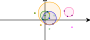

# Reflixir

Helper package to render Galixir Geometric Algebra objects in Livebook

## Installation

```elixir
def deps do
  [
    {:reflixir, "~> 0.1.0"}
  ]
end
```

## Example

Take a look at the [example LiveBook](./guides/example.livemd)

### CGA 2D

```elixir
alias Galixir.Algebras.CGA2

# create some 2d points
p0 = CGA2.point(10, 4)
p1 = CGA2.point(10, 15)
p2 = CGA2.point(0, 10)

# create some circles from a centere and radius
c1 = CGA2.circle(p0, 15)
c2 = CGA2.circle(p2, 10)
c3 = CGA2.circle(p1, 25)

# some more points
p4 = CGA2.point(50, 8)
p5 = CGA2.point(43, 20)
p6 = CGA2.point(60, 10)

# circle through 3 points
cc = CGA2.wedge(p4, p5) |> CGA2.wedge(p6)

# assign color to each object to render them on an SVG canvas
[
  {:blue, c1},
  {:green, c2},
  {:green, p2},
  {:orange, c3},
  {:orange, p1},
  {:blue, p0},
  {:hotpink, cc},
  {:purple, p4},
  {:purple, p5},
  {:purple, p6},
  #intersection between circle 2 and circle 3
  {{:orange, :green}, CGA2.meet(c2, c3)},
  #intersection between circle 1 and circle 2
  {{:blue, :green}, CGA2.meet(c1, c2)},
  #intersection between circle 1 and circle 3
  {{:blue, :orange}, CGA2.meet(c1, c3)},
  # point pair from two points
  {:green, CGA2.wedge(CGA2.point(20, 10), CGA2.point(10, -20))},
  {:magenta, CGA2.point(60, -16)}
]
|> Reflixir.CGA2Canvas.to_svg(
  thickness: 1,
  height: 40,
  width: 90,
  viewbox: {-100, -50, 200, 100}
)
```



### PGA 3D

```elixir
Reflixir.PGA3Screen.new(%{height: 3, width: 1}, fn %{height: h, width: w} ->
  pyramid_tip = PGA3.point(0, 0, h)

  Reflixir.PGA3Scene.new(
    points: [
      {"rebeccapurple", pyramid_tip},
      {"tomato", PGA3.point(w, w, 1)},
      {"tomato", PGA3.point(w, -w, 1)},
      {"tomato", PGA3.point(-w, -1, 1)},
      {"tomato", PGA3.point(-w, w, 1)},
      {"yellowgreen", PGA3.point(w, 0, 1)},
      {"yellowgreen", PGA3.point(-w, 0, 1)},
      {"yellowgreen", PGA3.point(0, -w, 1)},
      {"yellowgreen", PGA3.point(0, w, 1)},
      {"teal", PGA3.point(w, w, 0)},
      {"teal", PGA3.point(w, -w, 0)},
      {"teal", PGA3.point(-w, -w, 0)},
      {"teal", PGA3.point(-w, w, 0)}
    ],
    edges: [
      {"royalblue", {PGA3.point(w, w, 1), pyramid_tip}},
      {"royalblue", {PGA3.point(-w, w, 1), pyramid_tip}},
      {"royalblue", {PGA3.point(-w, -w, 1), pyramid_tip}},
      {"royalblue", {PGA3.point(w, -w, 1), pyramid_tip}},
      {"royalblue", {PGA3.point(w, w, 1), PGA3.point(-w, w, 1)}},
      {"royalblue", {PGA3.point(w, -w, 1), PGA3.point(-w, -w, 1)}},
      {"royalblue", {PGA3.point(-w, w, 1), PGA3.point(-w, -w, 1)}},
      {"royalblue", {PGA3.point(w, w, 1), PGA3.point(w, -w, 1)}},
      {"teal", {PGA3.point(w, w, 0), PGA3.point(-w, w, 0)}},
      {"teal", {PGA3.point(w, -w, 0), PGA3.point(-w, -w, 0)}},
      {"teal", {PGA3.point(-w, w, 0), PGA3.point(-w, -w, 0)}},
      {"teal", {PGA3.point(w, w, 0), PGA3.point(w, -w, 0)}},
      {"black", {PGA3.point(-5, 0, 0), PGA3.point(5, 0, 0)}},
      {"black", {PGA3.point(0, -5, 0), PGA3.point(0, 5, 0)}},
      {"black", {PGA3.point(0, 0, -3), PGA3.point(0, 0, 4)}}
    ],
    faces: [
      {"#4444",
       [
         PGA3.point(w, w, 0),
         PGA3.point(-w, w, 0),
         PGA3.point(-w, -w, 0),
         PGA3.point(w, -w, 0)
       ]},
      {"#5554",
       [
         PGA3.point(w, w, 1),
         PGA3.point(-w, w, 1),
         PGA3.point(-w, -w, 1),
         PGA3.point(w, -w, 1)
       ]},
      {"#0504",
       [
         PGA3.point(w, w, 1),
         PGA3.point(w, -w, 1),
         pyramid_tip
       ]},
      {"#5504",
       [
         PGA3.point(-w, w, 1),
         PGA3.point(-w, -w, 1),
         pyramid_tip
       ]},
      {"#0554",
       [
         PGA3.point(-w, -w, 1),
         PGA3.point(w, -w, 1),
         pyramid_tip
       ]},
      {"#5054",
       [
         PGA3.point(w, w, 1),
         PGA3.point(-w, w, 1),
         pyramid_tip
       ]}
    ],
    labels: [
      {"black", PGA3.point(5, 0, 0), "X"},
      {"black", PGA3.point(0, 5, 0), "Y"},
      {"black", PGA3.point(0, 0, 4), "Z"}
    ]
  )
end)
```


